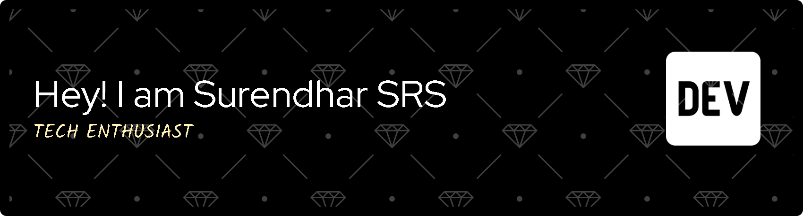

    

    

    

## 🚀 About Me

- 🎓 **B.Tech Computer Science Engineering** student at **Sri Manakula Vinayagar Engineering College**
- 💻 **Full Stack Web Developer** passionate about creating dynamic and responsive web applications
- 🐍 **Python Developer** with expertise in building scalable backend solutions
- 🤖 **AI/ML Enthusiast** - Creator of [Orion AI Workspace](https://orionaiworkspace.tech), an advanced AI-powered productivity platform
- 🌟 **Software Developer** focused on writing clean, efficient, and maintainable code
- 🔍 Always eager to learn new technologies and tackle challenging problems
- 📍 Based in **Puducherry, India**

## 🛠️ Tech Stack

### Frontend Development

### Backend Development

### Databases

### Tools & Technologies

## 📊 GitHub Stats

  
   
  
   
  

## 🏆 GitHub Trophies

  

## 🌟 Featured Projects

### 🤖 [Orion AI Workspace](https://orionaiworkspace.tech)
> Advanced AI-powered workspace platform for enhanced productivity and collaboration
- **Tech Stack:** Python, AI/ML, Web Technologies
- **Key Features:** Multi AI Integration (with users own api key), Workspace Management, Real-time Collaboration, 100% free & privacy
- [🔗 Live Demo](https://orionaiworkspace.tech) | [📂 Repository](https://github.com/Surendhar-SRS/orion-ai)

## 🎯 Current Focus

- 🔭 Working on **Orion AI Workspace** - an advanced AI-powered productivity platform
- 🌱 Currently learning **AI/ML technologies** and **advanced cloud architectures**
- 🤖 Exploring **artificial intelligence integration** in web applications
- 👯 Looking to collaborate on **AI-driven projects** and **open source contributions**
- 💬 Ask me about **Python, AI/ML, Web Development, Software Engineering**
- ⚡ Fun fact: **I love building AI solutions that make complex tasks simple and intuitive!**

## 📈 Activity Graph

  

## 🤝 Connect With Me

  

---

  
  
  ### 💡 *"Code is like humor. When you have to explain it, it's bad."* – Cory House
  
  **Thanks for visiting! Let's connect and build something amazing together! 🚀**

