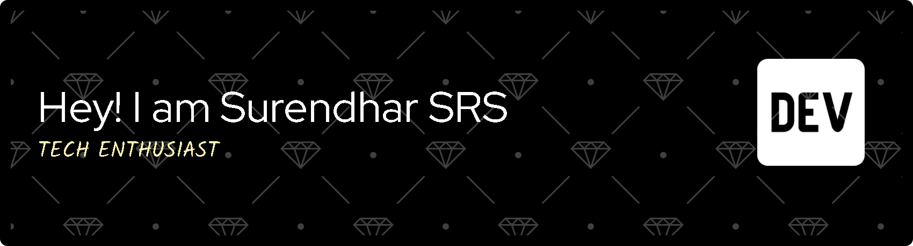

 

> 🎓 CSE student • 💻 Full Stack & AI/ML Engineer • 🤖 AI/ML Enthusiast • 📍 Puducherry, India

---

## 🚀 About Me

- 🎓 **B.Tech Computer Science Engineering** student at **Sri Manakula Vinayagar Engineering College**
- 💻 **Full Stack Web Developer** building dynamic, responsive web applications
- 🐍 **Python Developer** working on scalable backend solutions
- 🤖 Creator of [**Orion AI Workspace**](https://orionai.tech), an AI-powered productivity platform
- 🌱 Currently learning **AI/ML technologies** and **cloud architectures**
- 💬 Ask me about **Python, AI/ML, Web Development, and Software Engineering**
- ⚡ Fun fact: I love building AI solutions that make complex tasks simple and intuitive! 🚀

---

## 🌟 Featured Projects

### 🤖 [Orion AI Workspace](https://orionaiworkspace.tech)
> **An advanced AI-powered workspace platform for productivity and collaboration**

- **Tech Stack:** Python, FastAPI, React, AI/ML
- **Key Features:**
  - ✨ Multi-AI integration (bring your own API key)
  - 🔄 Workspace management
  - ⚡ Real-time collaboration
  - 🔐 100% free & privacy-focused

[🔗 Live Demo](https://orionai.tech) • [📂 Repository](https://github.com/Surendhar-SRS/orion-ai) • [🌐 Website](https://orionaiworkspace.tech)

---

## 🏆 Highlights

> 🚀 Selected for the **Google TPU Research Cloud (TRC)** program — granted free access to advanced Cloud TPU clusters to train deep learning models at scale.

---

## 🛠️ Tech Stack

> Technologies I've built projects around.

---

## 📊 GitHub Statistics

<table align="center">
<tr>
<td width="50%" align="center">

</td>
<td width="50%" align="center">

</td>
</tr>
<tr>
<td colspan="2" align="center">

</td>
</tr>
<tr>
<td colspan="2" align="center">

</td>
</tr>
<tr>
<td colspan="2" align="center">

</td>
</tr>
</table>

---

## 🤝 Connect With Me

 

### 💡 *"Intelligence isn't measured by what a system has memorized, but by the tools it knows how to wield. " -Surendhar SRS*

**Thanks for visiting — let's build something amazing together! 🚀**

⭐ If you find my projects helpful, consider giving them a star!

